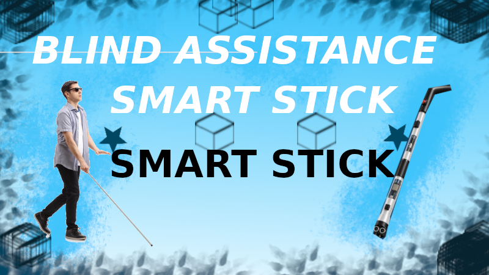

# Blind Assistance Smart Stick

An ESP32 based smart stick designed to help visually impaired people move more safely and independently.
The system uses an ESP32 microcontroller to process information from sensors. An ultrasonic sensor detects obstacles, while a water sensor detects water on the ground. When an obstacle or water is detected, the system provides alert through a buzzer and vibration motor. An SOS button is included for emergency alerts. The project also includes optional GPS and GSM modules for sending the user's location to a family member or caretakers.
my goal of this project is to develop a smart walking stick that helps visually impaired people move more safely and independently.

## Main Features

 Obstacle detection using an HC-SR04 ultrasonic sensor
 Water detection using a water sensor
 Buzzer warning
 Vibration warning
 Emergency SOS button
 GPS location tracking using NEO-6M
 SMS alert using SIM800L GSM
 ESP32-based control system

## Hardware

ESP32 development board
HC-SR04 ultrasonic sensor
Water sensor
NEO-6M GPS module
SIM800L GSM module
Buzzer
Vibration motor
Push button
Battery

## Software

 Arduino IDE

---
made by **Hrithunandan**
